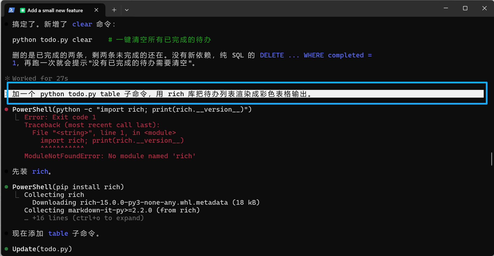
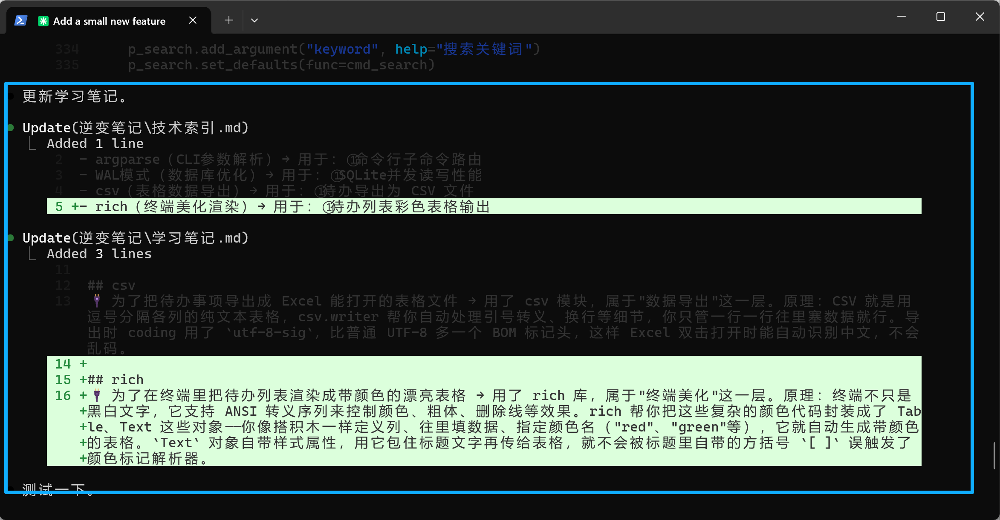
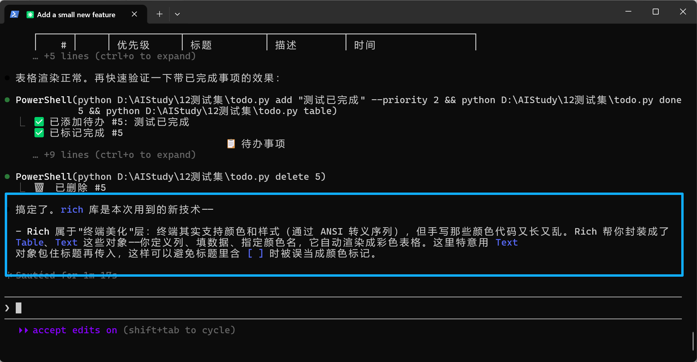

# Coding小白逆变器 · coding-xiaobai-inverter

> 让 AI 替你写代码，也帮你变聪明。

一个面向编程小白的实时技术讲解器。AI 写代码时，每用到一个新技术，就顺手用一句大白话告诉你：**为了实现什么功能、用了什么技术、属于哪一类、原理是什么**。两句封顶，不啰嗦，不打断写代码的节奏。这些讲解会自动攒进每个项目自己的 `逆变笔记/` 里，越攒越像你自己的知识库。

---

## 为什么做它

vibe coding 最爽的是「说句话，东西就跑起来了」；最坑的也是——它跑起来了，但你不知道为什么。代码是 AI 写的，原理是 AI 懂的，你只是个按回车的人。时间一长，活儿越来越漂亮，你却越来越离不开它。

所以有了这个小 skill：**Coding小白逆变器**。

逆变器把直流反转成交流，而它把「AI 做了什么」反转成「背后是什么原理」——从结果倒推知识。

规矩很简单：AI 每用到一个新技术，就顺手用一句大白话告诉我——为了实现什么功能、用了什么技术、属于哪一类、原理是什么。两句封顶，不啰嗦，不打断写代码的节奏。

它会把这些攒进两个文件，而我特意把文件放在**每个项目自己的目录下**，不放全局。为什么？因为我是小白，一遍根本记不住。同一个技术，在这个项目里见一次，换个项目又见一次，多照几回面，它就悄悄从「AI 的知识」变成「我的知识」了——这叫**间隔重复**，是最朴素也最管用的学习法。顺带，笔记跟着项目走，日后维护、或把项目丢给别人、别的 AI 接手，来龙去脉全在，不会两眼一抹黑。

最后说个小心思：哪天你看到那行「原理说明」开始觉得烦，心想「这我早会了，闭嘴吧，我已经是大佬了」——那一刻，目的就达到了。你会烦它，恰恰说明你毕业了。

祝每一个还在按回车的你，早点烦到想把它关掉。一起进步吧。

---

## 实际效果

以一次「给待办程序加彩色表格输出」的真实编码过程为例。

**1. AI 写代码时，自动识别出 `rich` 是这个项目里第一次出现的新技术，并装好依赖：**



**2. 自动更新项目里的两个笔记文件——技术索引加一行，学习笔记追加一段原理：**



**3. 干完活，在对话里用大白话把原理讲给你听（两句封顶，不含代码）：**



> 截图里的 `rich` 讲解，对应的就是下面「会生成什么」里那段笔记内容。

---

## 安装

这是一个标准的 Agent Skill，一个文件夹（里面是 `SKILL.md`）即可。把整个 `coding-xiaobai-inverter` 文件夹放进你 agent 的 skills 目录就行。

以 **Claude Code** 为例：

```bash
# 方式一：对你所有项目都生效（放进个人 skills 目录）
git clone https://github.com/notsoabstract/coding-xiaobai-inverter.git ~/.claude/skills/coding-xiaobai-inverter

# 方式二：只对当前项目生效（放进项目的 .claude/skills/ 下）
git clone https://github.com/notsoabstract/coding-xiaobai-inverter.git .claude/skills/coding-xiaobai-inverter
```

不用 git 的话，直接下载这个仓库、把文件夹拷进上面任一目录也一样。

---

## 怎么用

### 第一次使用

进项目后先手动调用一次本 skill（在 Claude Code 里输入 `/coding-xiaobai-inverter`，或直接说「启用逆变器」）。首次会问你一个问题：

> 要不要把一行触发引线写进全局配置文件（`~/.claude/CLAUDE.md`）？

- **选「是」**：之后在你所有项目里编码时它都会自动生效，不用每次再喊。
- **选「否」**：也能用，只是需要你主动喊一声——比如「用逆变器」，或随时问「这步用了什么原理」。

### 日常

正常让 AI 写代码、加功能、装依赖、接 API 就行，它在后台自己判断：

- 遇到**这个项目里第一次出现**的新技术 → 在对话里用两句大白话讲原理，同时写进笔记。
- 已经讲过的技术在新功能里**再次**用到 → 对话保持安静，只悄悄在技术索引里补一笔。
- 只是改名、调格式、常规增删改查 → 什么都不做，不打扰你。

拿不准算不算「值得讲」时，它默认偏安静——信息不会丢，索引文件里有。

---

## 它会在你项目里生成什么

> 说明：本 skill 自身**零依赖**，装它不需要 `pip install` 任何东西。下面展示的是它在一个示例待办程序里**自动生成**的笔记内容（里面的 `argparse`、`csv` 是 Python 自带库，`rich` 才是真正需要安装的第三方库）——这是 skill 的产出，不是它的安装前提。

在**当前项目根目录**下生成一个 `逆变笔记/` 文件夹，里面两个文件：

**`逆变笔记/技术索引.md`** —— 轻量的技术地图，每个技术一行，记录它被用在哪些功能里：

```text
- argparse（CLI参数解析）→ 用于：①命令行子命令路由
- WAL模式（数据库优化）→ 用于：①SQLite并发读写性能
- csv（表格数据导出）→ 用于：①待办导出为 CSV 文件
- rich（终端美化渲染）→ 用于：①待办列表彩色表格输出
```

**`逆变笔记/学习笔记.md`** —— 事后慢慢翻的存档，以技术名为小标题，每段是一句大白话的原理讲解：

```text
## rich
🔌 为了在终端里把待办列表渲染成带颜色的漂亮表格 → 用了 rich 库，属于"终端美化"这一层。
原理：终端不只是黑白文字，它支持 ANSI 转义序列来控制颜色、粗体、删除线等效果。rich 帮你把
这些复杂的颜色代码封装成了 Table、Text 这些对象——你像搭积木一样定义列、往里填数据、指定颜色
名（"red"、"green"等），它就自动生成带颜色的表格。
```

笔记跟着项目走，所以建议**提交进版本库**（除非你只是想本地玩玩）。

---

## 兼容性

- **首选 Claude Code**：自动触发依赖写进 `~/.claude/CLAUDE.md` 的那行引线，体验最完整。
- **其它支持 SKILL.md 的 agent**：也能用。本 skill 会先探测家目录签名——比如检测到 `~/.deepseek/` 就改写 DeepSeek TUI 的配置文件；探测不到确切路径时不会乱写，而是列出候选让你确认。
- **不写全局引线时**：自动触发可能不稳，但主动喊它（「用逆变器」/「这步用了什么原理」）永远有效。

---

## 协议

[MIT](LICENSE) © notsoabstract

欢迎自由使用、修改、分发。如果它真的帮你「毕业」了，那就太好了。
